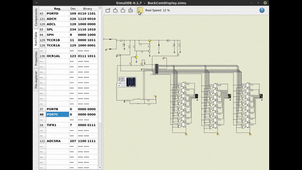

# Conversor Buck Microcontrolado
Este foi meu projeto de conclusão das matérias de Microcontroladores e Prototipação de Sistemas Eletrônicos no curso Técnico em Eletrônica. O assignment se baseava em, dado um esquemático de conversor buck microcontrolado que nosso grupo recebeu: 
- Substituir o microcontrolador do projeto por um ATMEGA328;
- Adicionar um display com a medida  de tensão de saída;
- Realizar as adequações necessárias dos componentes do circuito para ter compatibilidade com as características elétricas do novo MCU, projetando uma PCI para o circuito; 
- Montar e executar uma simulação utilizando um simulador chamado CADe Simu

Este repositório contém apenas o material da simulação, que é a parte do projeto que envolveu programação. 

É um projeto relativamente simples, mas que se presta a efetuar a tarefa com a clareza de como as evoluções de hardware impactam os projetos que os envolvem, que é o caso da presença de Output Compare Registers no ATMEGA328, que "liberam" processamento e incrementam a precisão do controle PWM, em compração aos métodos que eram utilizados em microcontroladores mais antigos, que usavam a própria interrupção de timer para tal fim.

# A simulacao
</img>
